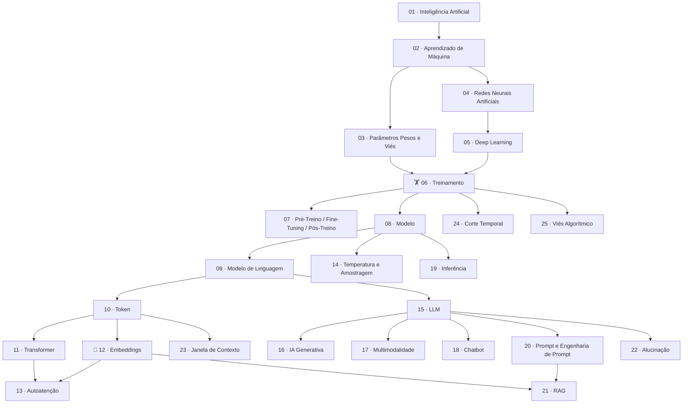

# 🗺️ MOC — Mapa do Conhecimento
## Codando Com InteligenciA · IFPB

> [!NOTE] O que é um MOC?
> **Map of Content** — uma nota central que funciona como índice e mapa de navegação do vault. Comece aqui!

👈 [[Sobre o Curso|← Voltar para a apresentação do curso]]

---

## Os 25 Conceitos de LLMs

---

## Tabela de Conceitos

| # | Conceito | Dificuldade | Link |
|---|----------|-------------|------|
| 1 | Inteligência Artificial | 🟢 Básico | [[01 - Inteligencia Artificial]] |
| 2 | Aprendizado de Máquina | 🟢 Básico | [[02 - Aprendizado de Maquina]] |
| 3 | Parâmetros (Pesos e Viés) | 🟡 Intermediário | [[03 - Parametros Pesos e Vies]] |
| 4 | Redes Neurais Artificiais | 🟡 Intermediário | [[04 - Redes Neurais Artificiais]] |
| 5 | Deep Learning | 🟡 Intermediário | [[05 - Deep Learning]] |
| 6 | Treinamento | 🟡 Intermediário | [[06 - Treinamento]] |
| 7 | Pré-Treino, Fine-Tuning e Pós-Treino | 🟡 Intermediário | [[07 - Pre-Treinamento Fine-Tuning e Pos-Treinamento]] |
| 8 | Modelo | 🟢 Básico | [[08 - Modelo]] |
| 9 | Modelo de Linguagem | 🟡 Intermediário | [[09 - Modelo de Linguagem]] |
| 10 | Token | 🟡 Intermediário | [[10 - Token]] |
| 11 | Transformer | 🔴 Avançado | [[11 - Transformer]] |
| 12 | Embeddings | 🔴 Avançado | [[12 - Embeddings]] |
| 13 | Autoatenção | 🔴 Avançado | [[13 - Autoatencao]] |
| 14 | Temperatura e Amostragem | 🟡 Intermediário | [[14 - Temperatura e Amostragem]] |
| 15 | LLM | 🟡 Intermediário | [[15 - LLM]] |
| 16 | IA Generativa | 🟢 Básico | [[16 - IA Generativa]] |
| 17 | Multimodalidade | 🟡 Intermediário | [[17 - Multimodalidade]] |
| 18 | Chatbot | 🟢 Básico | [[18 - Chatbot]] |
| 19 | Inferência | 🟡 Intermediário | [[19 - Inferencia]] |
| 20 | Prompt e Engenharia de Prompt | 🟡 Intermediário | [[20 - Prompt e Engenharia de Prompt]] |
| 21 | RAG | 🔴 Avançado | [[21 - RAG]] |
| 22 | Alucinação | 🟡 Intermediário | [[22 - Alucinacao]] |
| 23 | Janela de Contexto | 🟡 Intermediário | [[23 - Janela de Contexto]] |
| 24 | Corte Temporal | 🟢 Básico | [[24 - Corte Temporal]] |
| 25 | Viés Algorítmico | 🟡 Intermediário | [[25 - Vies Algoritmico]] |

---

## Parte 2 — Uso Responsável da IA

| Nota | Descrição |
|------|-----------|
| [[Rendicao Cognitiva vs Descarga Cognitiva]] | A diferença entre usar IA e ser usado pela IA |
| [[Debito Cognitivo]] | O preço invisível de não aprender enquanto usa IA |
| [[Como Estudar Com IA (Do Jeito Certo)]] | Estratégias práticas para aprender DE VERDADE com IA |
| [[Ferramentas - NotebookLM Gemini ChatGPT]] | Guia de quando e como usar cada ferramenta |
| [[Template - Questionario Gemini]] | Prompts prontos para gerar questionários de fixação |

---

## Papers e Referências Científicas

| Paper | Foco | Link |
|-------|------|------|
| Thinking Fast, Slow, Artificially | Cognitive Surrender — Wharton School | [[Thinking Fast Slow Artificially]] |
| Between Cognitive Offloading and Critical Autonomy | IA no ensino superior | [[Between Cognitive Offloading and Critical Autonomy]] |
| Designing Against Deskilling | Design de IA que preserva habilidades | [[Designing Against Deskilling]] |
| How AI Impacts Skill Formation | IA e formação de habilidades | [[How AI Impacts Skill Formation]] |
| Do Users Write More Insecure Code with AI? | Segurança e IA | [[Do Users Write More Insecure Code with AI]] |
| Security Vulnerabilities in AI-Generated Code | Vulnerabilidades em código IA | [[Security Vulnerabilities in AI-Generated Code]] |
| Avaliação da Aprendizagem em Programação com IA | Contexto EPT brasileiro | [[Avaliacao da Aprendizagem em Programacao Com IA]] |
| Attention Is All You Need | O paper que criou os Transformers | [[Attention Is All You Need]] |

---

## Categorias dos Conceitos

### Base Conceitual (O que é)
[[01 - Inteligencia Artificial]] · [[02 - Aprendizado de Maquina]] · [[04 - Redes Neurais Artificiais]] · [[05 - Deep Learning]] · [[08 - Modelo]] · [[15 - LLM]] · [[16 - IA Generativa]]

### Funcionamento (Como funciona)
[[03 - Parametros Pesos e Vies]] · [[06 - Treinamento]] · [[07 - Pre-Treinamento Fine-Tuning e Pos-Treinamento]] · [[10 - Token]] · [[11 - Transformer]] · [[12 - Embeddings]] · [[13 - Autoatencao]] · [[09 - Modelo de Linguagem]] · [[19 - Inferencia]]

### Aplicações (O que faz)
[[17 - Multimodalidade]] · [[18 - Chatbot]] · [[20 - Prompt e Engenharia de Prompt]] · [[21 - RAG]] · [[14 - Temperatura e Amostragem]]

### Limitações (Cuidado com)
[[22 - Alucinacao]] · [[23 - Janela de Contexto]] · [[24 - Corte Temporal]] · [[25 - Vies Algoritmico]]

---

> [!TIP] Como navegar este vault
> - Use **Ctrl+Click** em qualquer link `[[]]` para abrir a nota
> - No **Graph View** do Obsidian, você vai ver as conexões entre os conceitos visualmente
> - Conceitos com mais links são os mais fundamentais — comece por eles!
